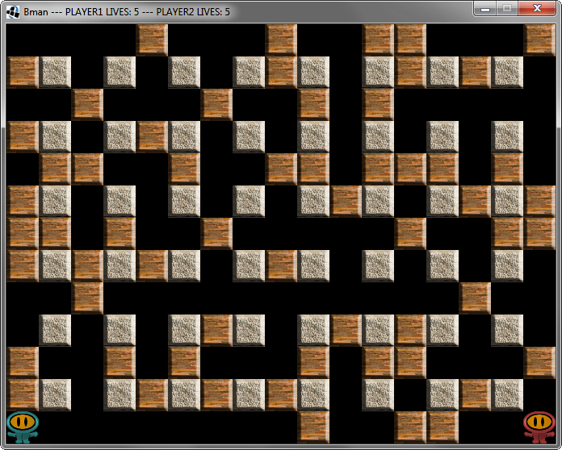

Bman
====

Bomberman clone made using Java8 and Lwjgl library (lwjgl.org)

This is the complete Intellij Idea project.

<b>To run go to Run > Edit Configurations and set the location of the native libraries in the VM options.</b> 
<b>Windows:</b> -Djava.library.path=lib\lwjgl\lwjgl-2.9.1\native\windows 
<b>OSX:</b>     -Djava.library.path=lib\lwjgl\lwjgl-2.9.1\native\macosx 
<b>Linux:</b>   -Djava.library.path=lib\lwjgl\lwjgl-2.9.1\native\linux 

<b>Control Player 1</b> 
W A S D - movement 
SPACE - place bomb
 
 
 
<b>Control Player 2</b> 
Arrow Keys - movement 
NUMPAD 0 - place bomb
 
 
 

